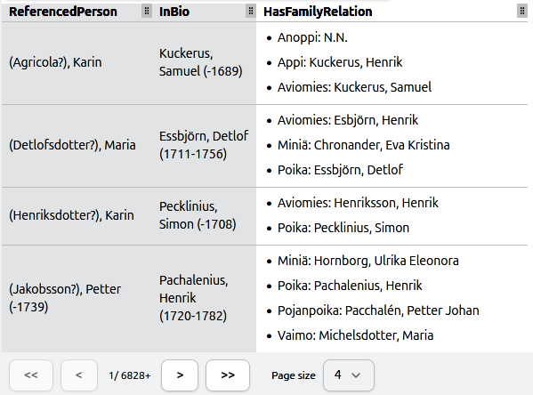
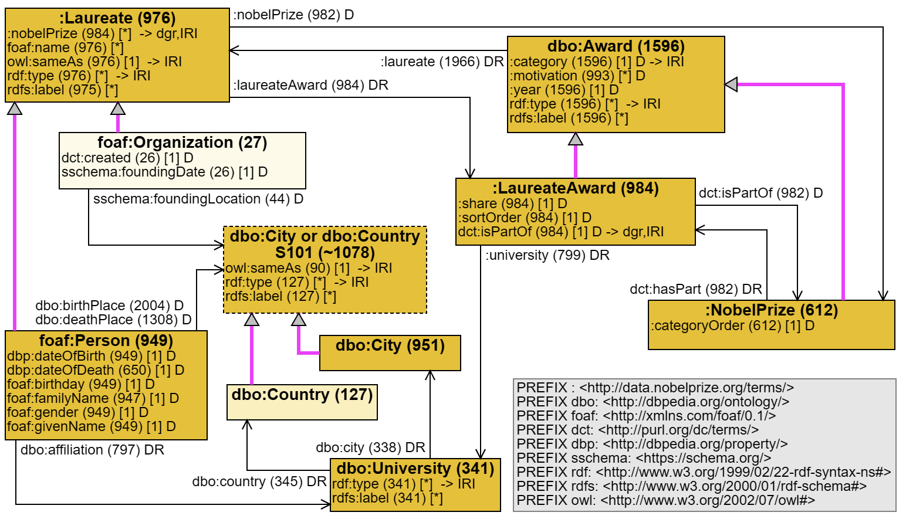

# Multicardinal table

## Introduction

This repository provides multicardinal table component -- table that can have cells with multiple values. Given a base query and function to perform sparql queries, multicardinal table will provide a paginated view with count information. In the example below multicardinal table demonstrates data from Academy Sampo dataset, using two columns as keys and having multiple values in `HasFamilyRelation` column cells.

Additionally, this repository exports a complex property selector that provides a UI that accepts RDF types and properties which are then converted into SPARQL query that can be paginated. The table does not require this selector but it can serve as a starting point for more user-friendly SPARQL query interfaces that do not require extensive knowledge of SPARQL syntax.

Multicardinal table has been integrated in [ViziQuer](https://viziquer.lumii.lv/) to provide an interface for querying datasets in which users do not need to know SPARQL. ViziQuer offers this functionality via interactive schema views that are available for several RDF datasets. An example of a schema can be seen below.

## Dev Notes

- "@radix-ui/react-use-controllable-state" is pinned to specific version because it's unstable. Since controllable state is useful to have and reinventing the existing wheel is not worth it, this library has been marked as a direct dependency.
- Added `main": "./dist/rdf-toolbag.js",` in `package.json`, so that this library can be imported locally and the entry point can be found properly.
- This project's key goal is to be integrated with Viziquer. In order to achieve this, the components are mounted into a shadow DOM root. The important consequence is that popover components (e.g. Combobox, Dialog) need to use `PortalContext` context so that users can specify a separate element (usually shadow DOM root that's a direct child of `body`). If this is not respected, the portal will mount outside shadow DOM (usually `document.body`) and the styling will most likely be overriden. 
- If you want to run some integration tests without docker, only keep *Oxigraph* as the query store provider. Oxigraph runs in memory via WASM and should cover most testing needs. Though, all query engines should be checked eventually.
